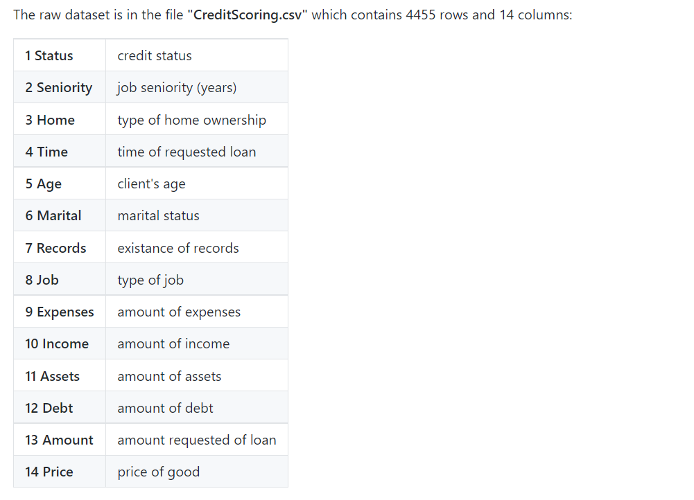

## Resumo de funções:

- initial_split()
- training()
- testing()


```{r setup}
# Pacotes ------------------------------------------------------------------
library(funModeling)
library(tidymodels)
library(tidyverse)
library(skimr)
library(visdat)
library(GGally)
library(pROC)
library(vip)
library(doFuture)
theme_set(theme_minimal(20))
```

# Fluxo de Trabalho do Tidymodels

## PASSO 0) CARREGAR AS BASES




```{r}
# https://github.com/gastonstat/CreditScoring 
# http://bit.ly/2kkBFrk
data("credit_data")
glimpse(credit_data) # German Risk
view(credit_data)

credit_data %>% count(Status)
```

## PASSO 1) BASE TREINO/TESTE

```{r}
set.seed(1)
credit_initial_split <- initial_split(credit_data, strata = "Status", prop = 0.75)

credit_train <- training(credit_initial_split)
credit_test  <- testing(credit_initial_split)
```

## PASSO 2) EXPLORAR A BASE

### Análise univar

```{r}
skim(credit_train)
```

```{r, fig.height=8, fig.width=8}
vis_miss(credit_train)
```

```{r, fig.height=8, fig.width=8}
plot_num(credit_train)
```

### Análise bivar

```{r, fig.width=10}
credit_train %>% 
  select(where(is.numeric)) %>% 
  cor(use = "p") %>% 
  corrplot::corrplot(addCoef.col = TRUE)
```

```{r, fig.height=12, message=FALSE, warning=FALSE}
credit_train %>% 
  select(where(is.numeric), Status) %>%
  ggpairs(aes(colour = Status))
```

### Análise bivar com a variável resposta

#### Vars categ

```{r, fig.height=8}
contagens <- credit_train %>% 
  select(c(where(is.factor), Status)) %>%
  pivot_longer(-Status, names_to = "variavel", values_to = "valor") %>%
  count(Status, variavel, valor)

# tabela
contagens %>% pivot_wider(names_from = Status, values_from = n)
```

```{r, fig.height=8}
contagens %>%
  ggplot(aes(y = valor, x = n, fill = Status)) +
  geom_col(position = "fill") +
  geom_label(aes(label = n), position = position_fill(vjust = 0.5)) +
  facet_wrap(~variavel, scales = "free_y") +
  ggtitle("Status vs. Variáveis Categóricas")
```

#### Vars numericas

```{r, fig.height=8}
credit_train_nums <- credit_train %>% 
  select(c(where(is.numeric), Status)) %>%
  pivot_longer(-Status, names_to = "variavel", values_to = "valor") 

boxplots <- credit_train_nums %>%
  ggplot(aes(y = Status, x = valor, fill = Status)) +
  facet_wrap(~variavel, scales = "free_x") +
  geom_boxplot()
```

```{r, fig.height=8}
boxplots + ggtitle("Status vs. Variáveis Numéricas")
```

```{r, fig.height=16, fig.width=13}
grafico_de_barras_das_vars_continuas <- function(dados) {
  dados %>% 
    select(c(where(is.numeric), Status)) %>%
    pivot_longer(-Status, names_to = "variavel", values_to = "valor") %>%
    dplyr::group_by(variavel) %>%
    dplyr::mutate(
      valor = factor(dplyr::ntile(valor, 10), levels = 1:10)
    ) %>%
    dplyr::count(Status, variavel, valor) %>%
    ggplot(aes(y = (valor), x = n, fill = Status)) +
    geom_col(position = "fill") +
    geom_label(aes(label = n), position = position_fill(vjust = 0.5)) +
    facet_wrap(~variavel, scales = "free_y", ncol = 3) +
    ggtitle("Status vs. Variáveis Categóricas")
}

grafico_de_barras_das_vars_continuas(credit_train)
```

## PASSO 3) DATAPREP

```{r}
# https://recipes.tidymodels.org/
# https://textrecipes.tidymodels.org/
# https://themis.tidymodels.org/
# https://embed.tidymodels.org/
# https://business-science.github.io/timetk/reference/index.html
# criando a receita
credit_recipe <- recipe(Status ~ ., data = credit_train) %>%
  step_zv(all_predictors()) %>%
  step_mutate(
    Home = ifelse(is.na(Home), "other", as.character(Home)),
    Job = ifelse(is.na(Job), "partime", as.character(Job)),
    Assets = ifelse(is.na(Assets), min(Assets, na.rm = TRUE), Assets),
    Income = ifelse(is.na(Income), min(Income, na.rm = TRUE), Income)
  ) %>%
  step_impute_mode(Marital) %>%
  step_impute_mean(Debt) %>%
  step_normalize(all_numeric()) %>%
  step_novel(all_nominal_predictors())

credit_recipe
```

```{r, fig.height=15}
receita_preparada <- prep(credit_recipe)

# criando a base preparada
credit_preparada <- bake(receita_preparada, new_data = NULL)
glimpse(credit_preparada)
```

```{r, fig.height=12, fig.width=10}
# olhando a base preparada
vis_miss(credit_preparada)
```

```{r, fig.height=13}
credit_preparada %>% 
  select(c(where(is.factor), Status)) %>%
  pivot_longer(-Status, names_to = "variavel", values_to = "valor") %>%
  count(Status, variavel, valor) %>%
  ggplot(aes(y = valor, x = n, fill = Status)) +
  geom_col(position = "fill") +
  geom_label(aes(label = n), position = position_fill(vjust = 0.5)) +
  facet_wrap(~variavel, scales = "free_y", ncol = 3) +
  ggtitle("Status vs. Variáveis Categóricas")
```

```{r, fig.height=15}
grafico_de_barras_das_vars_continuas(credit_preparada)
```

```{r}
# finalizando a receita com dummies
credit_recipe_com_dummies <- credit_recipe %>%
  step_dummy(all_nominal_predictors(), one_hot = TRUE)

receita_preparada_com_dummies <- prep(credit_recipe_com_dummies)

# criando a base preparada
credit_preparada_com_dummies <- bake(receita_preparada_com_dummies, new_data = NULL)
glimpse(credit_preparada_com_dummies)
```

## PASSO 4) MODELO

```{r}
# https://www.tidymodels.org/find/parsnip/
# https://curso-r.github.io/treesnip/

# Definição de 
# a) a f(x): logistc_reg(), rand_forest(), etc.
# b) modo (natureza da var resp): classification
# c) hiperparametros que queremos tunar: penalty = tune()
# d) hiperparametros que não queremos tunar: mixture = 1 # LASSO
# e) o motor que queremos usar: set_engine("glmnet")
credit_lr_model <- rand_forest(mtry = tune(), trees = 200, min_n = tune()) %>%
  set_mode("classification") %>%
  set_engine("ranger", importance = "impurity")

# workflow
credit_lr_wf <- workflow() %>% add_model(credit_lr_model) %>% add_recipe(credit_recipe_com_dummies)
```

## PASSO 5) TUNAGEM DE HIPERPARÂMETROS

```{r}
# https://tune.tidymodels.org/
# https://rsample.tidymodels.org/

# a) bases de reamostragem para validação: vfold_cv()
# b) (opcional) grade de parâmetros: parameters() %>% update() %>% grid_regular()
# c) tune_grid(y ~ x + ...)
# d) escolha das métricas (rmse, roc_auc, etc)
# d) collect_metrics() ou autoplot() para ver o resultado
credit_resamples <- vfold_cv(credit_train, v = 5)
```


```{r}
registerDoFuture()
plan(multisession)
tictoc::tic("rf")
credit_lr_tune_grid <- tune_grid(
  credit_lr_wf,
  resamples = credit_resamples,
  grid = 20,
  metrics = metric_set(accuracy, roc_auc),
  control = control_grid(allow_par = TRUE, parallel_over = "everything", save_workflow = TRUE)
)
tictoc::toc()
plan(sequential)

autoplot(credit_lr_tune_grid)
show_best(credit_lr_tune_grid, metric = "roc_auc")
collect_metrics(credit_lr_tune_grid)
```

## PASSO 6) DESEMPENHO DO MODELO FINAL

```{r}
# a) extrai melhor modelo com select_best()
# b) finaliza o modelo inicial com finalize_model()
# c) ajusta o modelo final com todos os dados de treino (bases de validação já era)
credit_lr_best_params <- select_best(credit_lr_tune_grid, "roc_auc")
credit_lr_wf <- credit_lr_wf %>% finalize_workflow(credit_lr_best_params)

credit_lr_last_fit <- last_fit(
  credit_lr_wf,
  credit_initial_split
)
```

```{r}
# métricas de desempenho
collect_metrics(credit_lr_last_fit)
```

```{r}
# base de teste com as predições
collect_predictions(credit_lr_last_fit)
```

### Variáveis importantes

```{r}
# extrai o modelo do objeto de ajuste
credit_lr_last_fit_model <- pull_workflow_fit(credit_lr_last_fit$.workflow[[1]])

# tabela de betas
vi(credit_lr_last_fit_model)
```

```{r}
# gráfico de Variable Importances
vip(credit_lr_last_fit_model)
```


### Métricas de desempenho

```{r}
collect_metrics(credit_lr_last_fit)

credit_test_preds <- collect_predictions(credit_lr_last_fit)

# roc e lift
credit_test_preds %>% roc_auc(Status, .pred_bad) 
credit_test_preds %>% roc_curve(Status, .pred_bad) %>% autoplot()
credit_test_preds %>% lift_curve(Status, .pred_bad) %>% autoplot()
```

```{r}
credit_test_preds %>%
  ggplot(aes(x = .pred_bad, colour = Status)) +
  stat_ecdf()

ks.test(
  credit_test_preds %>% filter(Status == "bad") %>% pull(.pred_bad),
  credit_test_preds %>% filter(Status == "good") %>% pull(.pred_bad)
)
```


### Gráficos extras

```{r, fig.width=5, fig.height=6}
# risco por faixa de score (multiplas notas de corte)]
percentis = 15
credit_test_preds %>%
  mutate(
    score =  factor(ntile(.pred_bad, percentis))
  ) %>%
  count(score, Status) %>%
  ggplot(aes(y = score, x = n, fill = Status)) +
  geom_col(position = "fill") +
  geom_label(aes(label = n), position = "fill")
```

```{r, fig.width=9, fig.height=6}
# gráfico sobre os da classe "bad"
credit_test_preds %>%
  mutate(
    score = factor(ntile(.pred_bad, percentis))
  ) %>%
  filter(Status == "bad") %>%
  group_by(score) %>%
  summarise(
    n = n(),
    media = mean(.pred_bad)
  ) %>%
  mutate(p = n/sum(n)) %>%
  ggplot(aes(x = p, y = score)) +
  geom_col() +
  geom_label(aes(label = scales::percent(p)), hjust = 1.1) +
  geom_vline(xintercept = 1/percentis, colour = "red", linetype = "dashed", size = 1)
```

## PASSO 7) MODELO FINAL

### Ajuste final

```{r}
credit_final_lr_model <- fit(credit_lr_wf, credit_data)
```

### Variáveis do modelo final

```{r}
# extrai o modelo do objeto de ajuste
credit_final_lr_fit <- credit_final_lr_model$fit$fit

# importancia das variaveis
vi(credit_final_lr_fit)
vip(credit_final_lr_fit)

# salva tudo no computador
write_rds(credit_final_lr_model, "credit_final_lr_model.rds")
write_rds(credit_lr_last_fit, "credit_lr_last_fit.rds")
```

### predições

```{r}
# predições
dados_novos <- testing(credit_initial_split)
predict(credit_final_lr_model, new_data = dados_novos, type = "prob")

# colocar no BD
dados_novos <- bind_cols(
  dados_novos,
  predict(credit_final_lr_model, new_data = dados_novos, type = "prob")
)

# predição individual
uma_obs <- data.frame(
    Seniority = 17	,
    Home = "rent", 
    Time = 60,
    Age = 58,
    Marital = "widow",
    Records = "no",
    Job = "fixed",
    Expenses = 48,
    Income = 131,
    Assets = 0,
    Debt = 0,
    Amount = 1000,
    Price = 1658
  )

credit_final_lr_model %>% predict(uma_obs,"prob")
```
